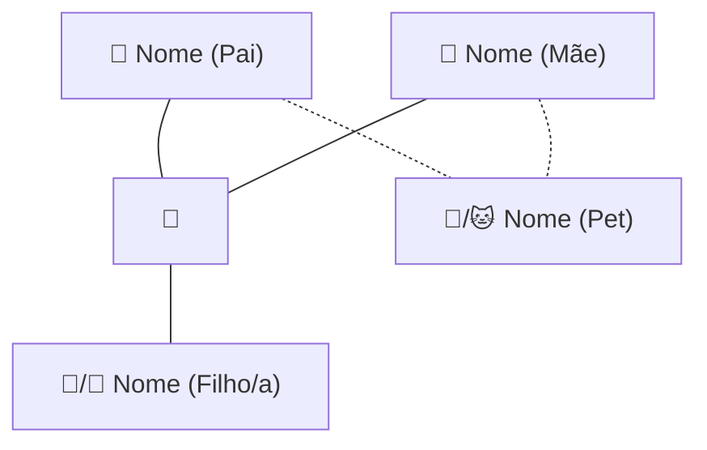

# Árvore da Família

<!-- Diagrama visual da família gerado pelo Salus -->
<!-- Adicione os membros conforme a estrutura familiar. Use linhas sólidas (---) para relações humanas e pontilhadas (-.-) para pets. -->

